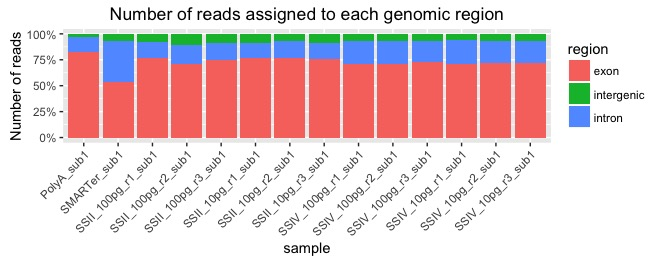

## Determine the proportion of reads assigned to intron, intergenic, exon in human hg19 / EnsDb.Hsapiens.v75

Given a RNA-seq run, we are interested to determine what proportions of reads are assigned to Exon, Intron or Intergenic regions Specifically using featureCounts to determine the proportion of reads in each region

The workflow consits of these main steps  
* Step 1 - Prepare SAF file format to be used for featureCounts  
* Step 2 - Running featureCounts on the prepared SAF file  
* Step 3 - Graph and anlysis  

### Step 1 - Prepare SAF file format
Generate a bed file which specifies the exon, intron and intergenic region  
Rscript `GettingRegion.R`

### Step 2 - Runing featureCounts  
Use featureCount to detemine number of reads mapped to each region. Please note the `strandSpecific` settings in featureCount. Some library preparation needs to use a different strand orientation.    
Note - Example bam file not provided, edit the script below to indicate the path to BAM file  
Rscript `featureCount.R`

### Step 3 - Graph and analysis
Prociessing featureCounnts sumamry.  
Rscript `process_featureCounts.R`

Final result would look something like this ; 

